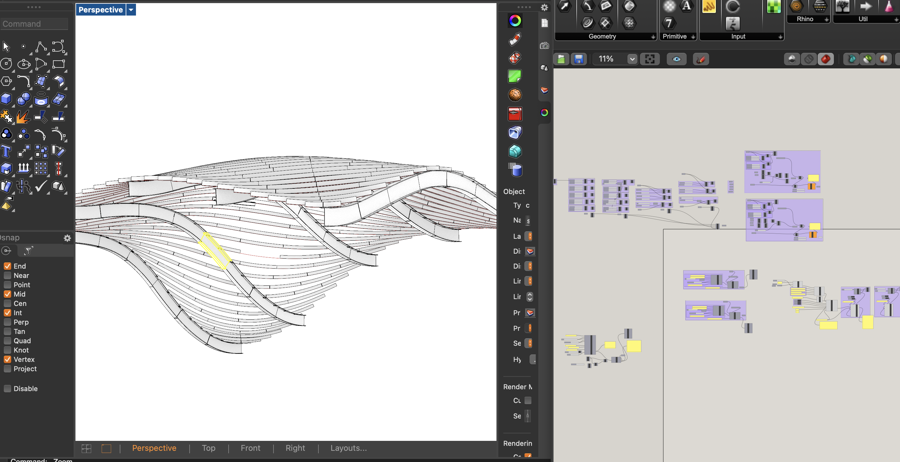
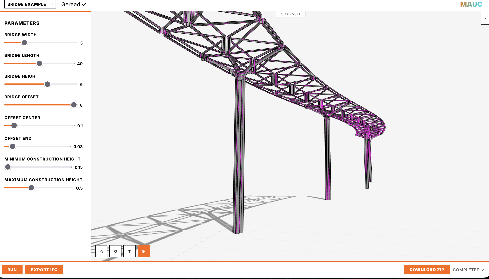

# ifckit

Framework-agnostic IFC builder library for architecture and infrastructure.


[](https://maucworks.github.io/ifckit/)

Build valid IFC files in pure Python — no CAD host required.
Works standalone, from Grasshopper, or via the JSON/CLI interface.

Files created can be viewed in its companion [IfcViewer](https://github.com/maucworks/web-ifc-viewer)

**Live: [maucworks.github.io/web-ifc-viewer](https://maucworks.github.io/web-ifc-viewer/?ifc=https%3A%2F%2Fraw.githubusercontent.com%2Fmaucworks%2Fweb-ifc-viewer%2Frefs%2Fheads%2Fmaster%2Fres%2Ftest.ifc)**

<figure>
  
  <figcaption>IfcKit integrated with Grasshopper via the JSON pipeline.</figcaption>
</figure>
<br>
<br>
<br>
<figure>
  
  <figcaption>IfcKit as the pythonic gernerator core of a configurator.</figcaption>
</figure>


## Install

```bash
pip install ifckit[ifc]    # with ifcopenshell (full functionality)
pip install ifckit         # without ifcopenshell (JSON/schema tools only)
```

Requires Python 3.9+ (Rhino 8 ships CPython 3.9; needs `ifcopenshell==0.8.4.post1`, see below).

## Quick start: building

```python
from ifckit import IfcModel, IfcSchema, PendingWall, Vec, Plane

model = IfcModel(name="My Project", schema=IfcSchema.IFC4, author="you")
floor = model.add_site("Site A").add_building("Building 1").add_storey("Ground Floor", elevation=0.0)

wall = PendingWall(
    footprint=[Vec(0, 0, 0), Vec(10, 0, 0), Vec(10, 0.3, 0), Vec(0, 0.3, 0)],
    plane=Plane.world_xy(),
    height=3.0,
    name="North Facade",
)
floor.add(wall)
model.save("project.ifc")
```

See `examples/quickstart.py` and `examples/simple_building.py` for fuller examples.

## Quick start: bridge

```python
from ifckit import IfcModel, IfcSchema, LengthUnit, PendingBeam, Vec, Line, BridgePartType, IBeamProfile

model = IfcModel(name="Bridge", schema=IfcSchema.IFC4X3, author="you", unit=LengthUnit.MILLIMETRE)
deck = model.add_site("Site A").add_bridge("Main Bridge").add_bridge_part("Deck", BridgePartType.DECK.value)

profile = IBeamProfile(height=600, width=300, web_thickness=10, flange_thickness=10)
beam = PendingBeam(axis=Line(Vec(0, 0, 0), Vec(3000, 0, 0)), profile=profile, name="Main Girder")
deck.add(beam)

model.save("bridge.ifc")
```

See `examples/quickstart_bridge.py` and `examples/simple_bridge.py` for fuller examples including alignments.

## Supported schemas and element types

| Element | Class | IFC4 | IFC4X3 |
|---|---|:---:|:---:|
| Wall | `PendingWall` | ✓ | |
| Slab | `PendingSlab` | ✓ | |
| Column | `PendingColumn` | ✓ | |
| Beam | `PendingBeam` | ✓ | ✓ |
| Space | `PendingSpace` | ✓ | |
| Alignment | `PendingAlignment` | | ✓ |

Profiles: `IBeamProfile`, `LBeamProfile`, `SteelProfile`, and arbitrary polygon profiles.

## JSON build

Build an IFC file from a JSON description — useful for CLI pipelines and REST APIs:

```python
from ifckit.json_build import build

build("model.json", "output.ifc")
```

Or from the command line:

```bash
python -m ifckit model.json output.ifc
```

The JSON schema mirrors the Python API. See `examples/example_building.json` for a full example.

## Grasshopper

Grasshopper Script components are in `grasshopper/src/`. Each component is a
standalone Python file with `@component` / `@input` / `@output` annotations.

To regenerate the `.gh` file from source, run `grasshopper/script/build_gh.py`
inside the Rhino ScriptEditor with Grasshopper open.

### Installing ifckit in Rhino 8

Rhino 8 ships with its own CPython 3.9 environment. That pins the
ifcopenshell line: **0.8.4.post1 is the last release with Python 3.9
wheels**, so install it explicitly — the `[ifc]` extra would pull 0.9.0,
which requires Python 3.10+. From the **Rhino ScriptEditor**
(`EditPythonScript`) or a Script component:

```python
import subprocess, sys
subprocess.run(
    [sys.executable, "-m", "pip", "install",
     "ifckit", "ifcopenshell==0.8.4.post1"],
    check=True,
)
```

ifckit detects the 0.8 serializer API automatically (see
`ifckit.geom_backend`); all build/save/export paths work on both lines.

To install a local development checkout instead:

```python
import subprocess, sys
subprocess.run(
    [sys.executable, "-m", "pip", "install", "-e", r"C:\path\to\ifckit"],
    check=True,
)
```

After installing, restart Rhino once to make the package available in all
Script components.

## Development

```bash
pip install -e ".[dev]"
pytest tests/          # run tests
ruff check ifckit/     # lint
```
